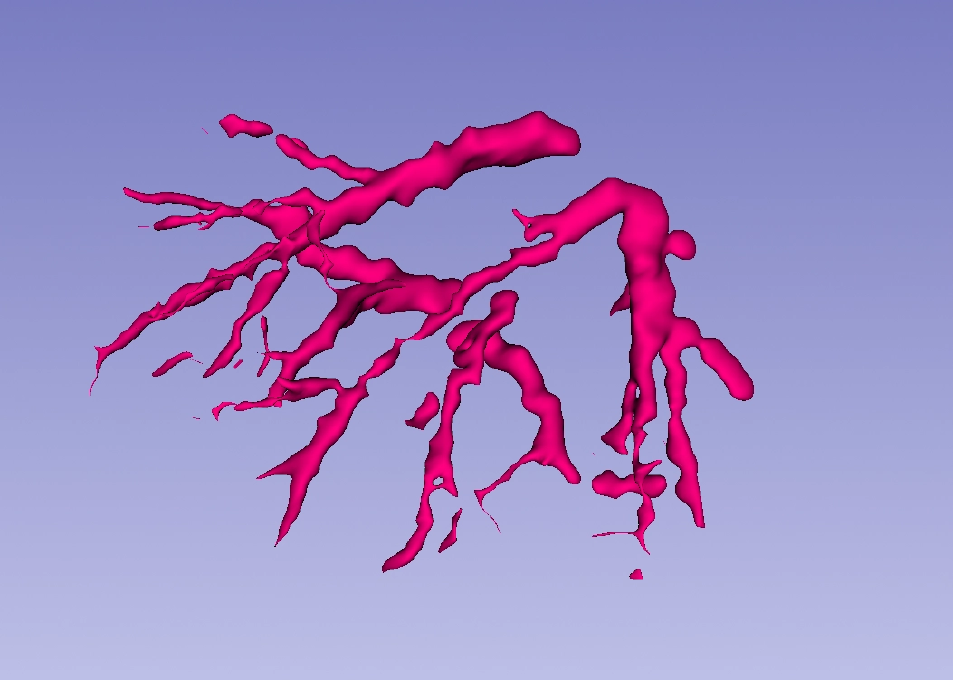
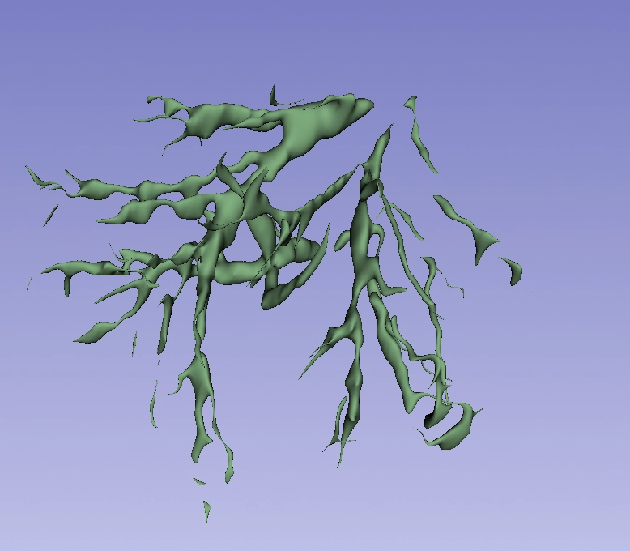
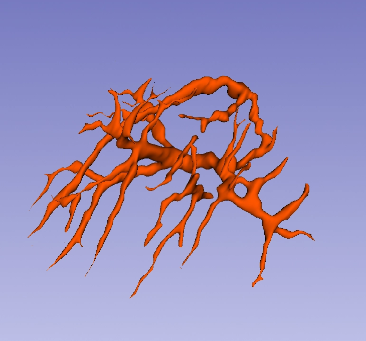
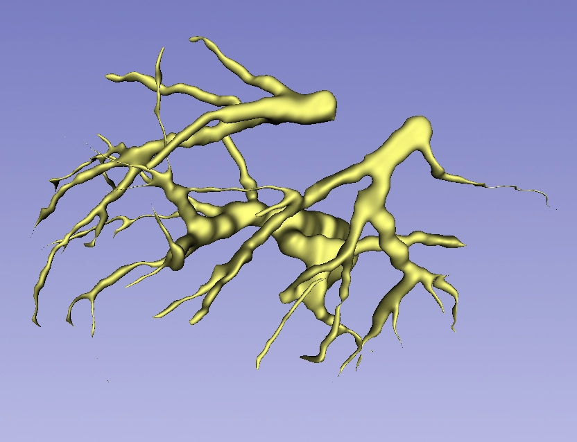

# 肝脏血管手工标注与3D重建

## 项目概述
基于CT影像的肝脏血管手工标注，完成3D可视化重建。

## 能力说明
- **标注效率**：40-60分钟完成完整肝脏血管树标注
- **数据格式**：DICOM输入 → 3D模型输出（.obj/.stl）
- **工具链**：3D Slicer / ITK-SNAP + Python可视化

## 示例展示

### 案例1：肝脏血管3D重建

### 案例2：肝脏血管3D重建

### 案例3：肝脏血管3D重建

### 案例4：肝脏血管3D重建

## 技术细节
- 纯手工标注，保证分割精度
- 支持旋转查看的3D模型生成
- 可导出用于3D打印或手术规划

## 当前局限 & 下一步
- 目前专注肝脏血管，胆管/腹水标注待补充数据集
- 计划探索半自动分割算法（UNet/nnU-Net）提升效率

## 联系方式
如有医学影像标注合作需求，欢迎联系13982264759

---

## 🛠️ Python数据处理工具

除手工标注外，具备医学影像自动化处理能力：

### DICOM元数据批量提取器

**解决的问题**：医院导出的DICOM文件通常无扩展名（纯数字命名），手工查看107层CT的元数据效率极低。

**实现功能**：
- 自动识别无扩展名DICOM文件（鲁棒性读取）
- 批量提取关键参数：PatientID、StudyDate、SliceThickness、Rows、Columns
- 输出标准化CSV报表，下游工具可直接读取

**技术栈**：Python + pydicom + csv

**处理规模**：单次批量处理107层CT序列（1个完整病例）

**代码位置**：`tools/dicom_extractor.py`

---

## 📈 能力矩阵

| 方向 | 具体能力 | 工具/技术 |
|------|----------|-----------|
| **影像标注** | 肝脏血管手工标注、ROI勾画、三维重建 | 3D Slicer、ITK-SNAP |
| **数据处理** | DICOM批量解析、元数据提取、格式标准化 | Python、pydicom |
| **下一步** | DICOM→NIfTI格式转换（算法标准输入格式） | SimpleITK |

---

## 💡 个人背景

7年放射技师临床经验（持有放射技师资格证），熟悉DICOM质控与影像解剖，正在向医疗AI数据工程方向转型。

**适合岗位**：医学影像数据工程师、影像标注质控、三维重建数据处理、医疗AI数据专员
