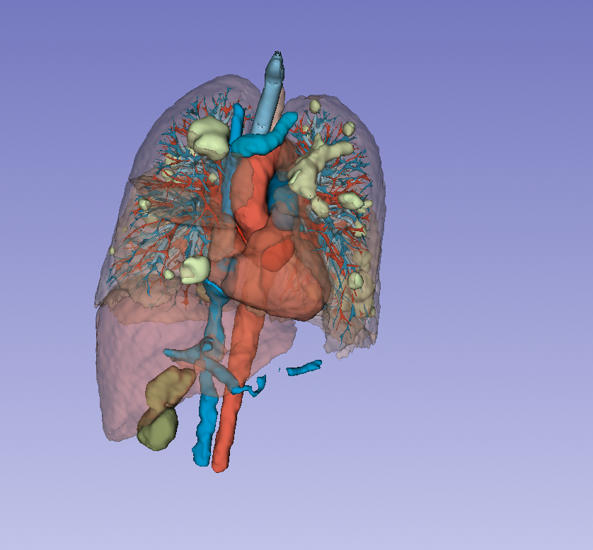
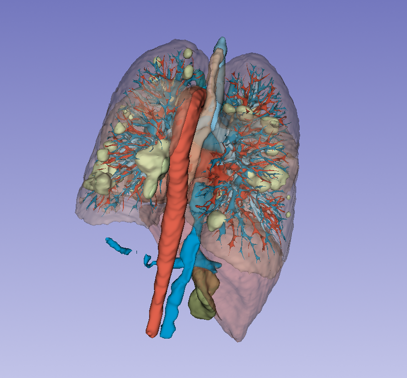
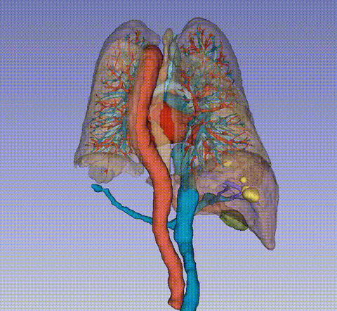

# 医学影像标注与数据处理实践

**放射技师背景（7年临床经验，持证）｜ 正在向医疗AI数据工程转型**

📍 成都 ｜ 求职意向：医学影像数据工程师 / AI标注员 / 三维重建数据处理

---

## 我能做什么

| 方向 | 具体实践 | 本页验证 |
|------|---------|---------|
| **手工结构标注** | 肝脏实质 + 血管系统联合分割与独立分离 | Case 1 |
| **AI辅助标注** | TotalSegmentator 命令行调用 + 手工修正 | Case 2 |
| **批量数据工程** | 230例DICOM批量转NIfTI、元数据提取、CSV报表 | Case 3 |
| **环境排错** | 独立解决内存、权重路径、License等部署问题 | 工程实践 |

---

## 案例展示

### Case 1：肝脏血管系统精细标注

| 项目 | 内容 |
|------|------|
| **数据** | 腹部CT增强扫描（107层，门脉期） |
| **完成内容** | 肝脏实质外壳 + 血管系统联合标注与独立分离 |
| **耗时** | 40–60 分钟/例 |
| **方式** | 纯手工精细标注 |

**图例：**
- 🟫 肝脏实质（褐色半透明外壳，显示整体轮廓与分叶）
- 🟡 肝脏病灶（病变区域高亮标注）
- 🔵 肝门静脉主干及左、右分支
- 🔴 腹主动脉 / 肝动脉系统
- 🟢 胆管 / 胆囊（浅绿色）

**联合视图**（整体解剖关系）：

**独立分离视图**（去除肝脏实质，清晰展示血管树走行与分支）：

> 联合视图用于确认解剖位置关系，独立分离视图用于展示血管树细节，适用于教学演示或进一步分析。

---

### Case 2：胸部CT多结构 AI 辅助分割

| 项目 | 内容 |
|------|------|
| **数据** | 胸部CT（PE增强扫描） |
| **结构** | 肺叶（5叶）、肺动静脉、气管树 |
| **流程** | TotalSegmentator CLI → 3D Slicer 导入 → 手工精修 → MRB 导出 |

**技术要点：**
- 命令行独立运行（非仅 GUI 操作），支持参数定制
- 独立解决 License 配置、权重路径缺失、内存不足等部署问题
- 对 AI 分割结果进行局部精细修正后交付

**360° 旋转演示：**

  
  

---

### Case 3：230例结直肠癌CT批量 DICOM → NIfTI 转换

| 项目 | 内容 |
|------|------|
| **数据集** | StageII-Colorectal-CT（公开数据集，230例，6.80 GB） |
| **输入** | DICOM（5层嵌套目录，UID命名子文件夹，切片无扩展名） |
| **输出** | `.nii.gz` 压缩NIfTI，按 PatientID 平铺命名（001–230） |
| **结果** | ✅ 230/230 成功，0 失败，耗时 **5分02秒** |
| **输出总量** | 8.07 GB |

**工程方案流程：**

metadata.csv（S5cmdManifestPath 列）
↓ 直接读取精确路径，无需递归扫描
dicom2nifti.convert_directory()
↓ 临时目录承接，自动处理 .nii → gzip
{PatientID}.nii.gz 平铺输出
↓ 断点续传，已完成自动跳过
转换报告.csv（每例状态 + 压缩前后大小）

**关键技术决策：**
- 识别到 CSV 的 `S5cmdManifestPath` 列已记录精确路径，
  **放弃递归扫描**，直接定址，避免误识别 `metadata` 等非DICOM目录
- UID 风格文件夹名（`1.3.6.1.4.1...`）自动识别跳过，
  输出文件名统一来自 `PatientID` 列
- 全程 `dicom2nifti` + Python 标准库，依赖最小化

**交付验证：**

> 脚本见：[`tools/dicom_to_nifti_batch.py`](tools/dicom_to_nifti_batch.py)

---

## 工程实践（工作习惯）

**处理过的典型问题：**
- TotalSegmentator 权重路径配置、Dataset 权重缺失修复（跨模型复制应急方案）
- 虚拟内存不足导致蓝屏的排查与优化（物理16GB，虚拟内存扩展至32GB）
- CUDA 环境不可用时的 CPU 降级运行方案
- License 申请与命令行激活（`totalseg_set_license`）
- 无扩展名 DICOM 文件的批量识别与解析

**个人工作流：**
1. **先试后做**：小数据跑完整流程验证环境，再正式批量处理，
   避免在完整数据上踩环境问题
2. **多AI分工**：Perplexity 起草、GPT 规划、Claude 执行代码与文档、
   Gemini 图文分析、Kimi 读长文献、Grok 实时检索，各司其职
3. **批处理思维**：用 Python 脚本替代重复手工操作

---

## Python 数据处理工具

**`tools/dicom_extractor.py` — DICOM 元数据提取器**

解决场景：医院导出的 DICOM 常无扩展名（纯数字命名），手工查看 107 层元数据效率低。

功能：
- 自动识别无扩展名 DICOM 文件
- 提取 PatientID、StudyDate、SliceThickness、Rows、Columns
- 输出 CSV 报表供下游使用

已验证：单次处理 107 层 CT 序列稳定运行。

**`tools/dicom_to_nifti_batch.py` — 批量 DICOM 转 NIfTI**

- CSV 引导路径，无需递归扫描硬盘
- 断点续传，已完成自动跳过
- 生成转换报告 CSV

已验证：230 例批量转换，0 失败。

---

## 背景说明

| | |
|---|---|
| **临床基础** | 7年放射技师，持资格证，熟悉CT/MRI操作与DICOM质控流程 |
| **转型方向** | 医疗AI数据标注与处理，已完成手工标注→AI辅助→数据工程的初步实践 |
| **求职意向** | 医学影像数据工程师、AI标注员、三维重建数据处理（入门及中级） |
| **学习能力** | 能独立查文档解决环境报错，理解nnUNet等框架基本结构，持续学习中 |

---

## 联系

- 💬 微信：-Pudgala
- 📧 邮箱：284397146 [at] qq.com
- 🔗 本页：https://github.com/qq284397146-cpu/liver-vessel-segmentation

---

> ⚠️ **数据声明**：本页所有影像数据均已脱敏处理，符合医疗数据隐私规范。  
> 公开数据集 StageII-Colorectal-CT 来源于 TCIA，遵循原始许可协议。
