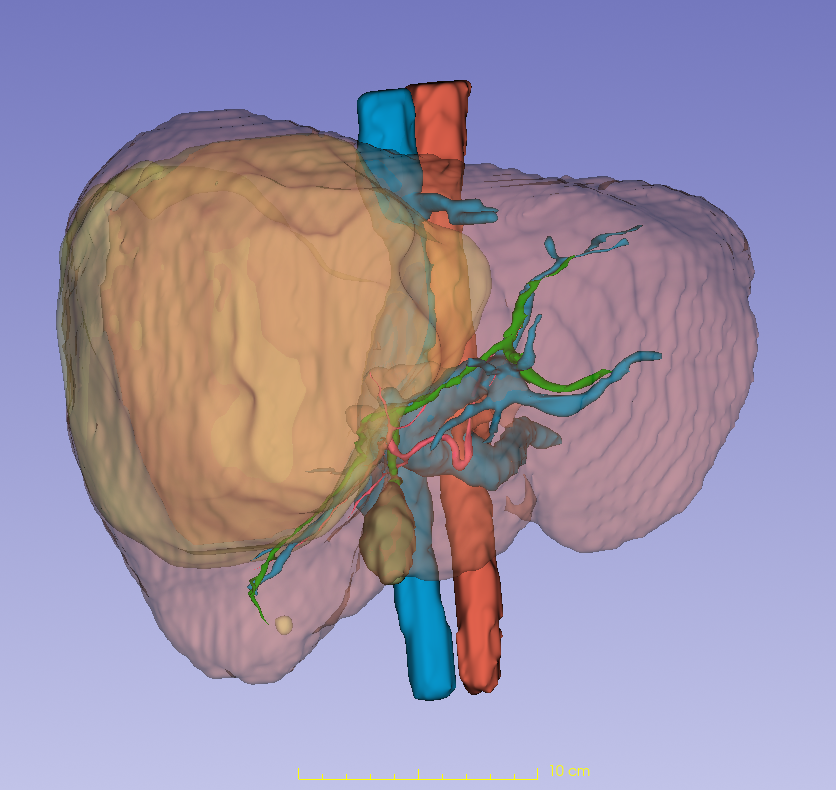
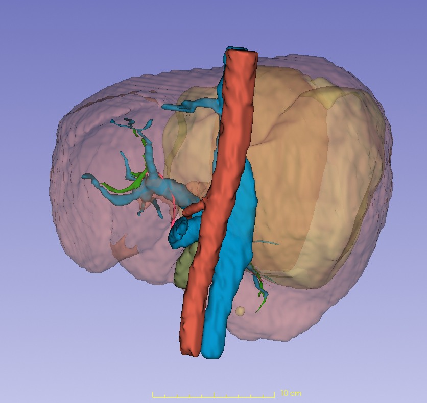
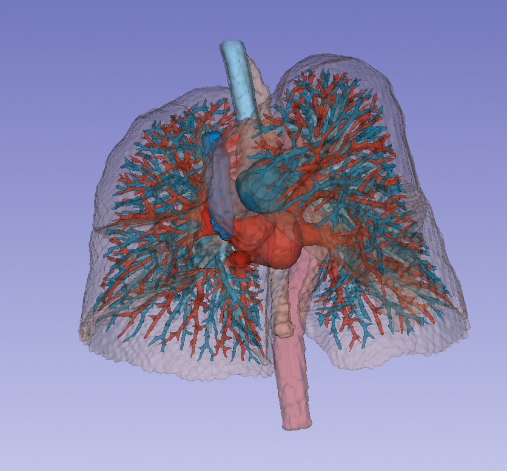

# 医学影像标注与数据处理实践

&gt; 放射技师背景（7年临床经验，持证） | 正在向医疗AI数据工程转型  
&gt; 联系方式：13982264759

---

## 我能做什么

| 方向 | 具体实践 | 本页验证 |
|------|---------|---------|
| **手工结构标注** | 完成肝脏实质+血管系统的联合分割与独立分离 | Case 1 |
| **AI辅助标注** | TotalSegmentator命令行调用 + 手工修正优化 | Case 2 |
| **数据工程** | DICOM批量解析、元数据提取、CSV报表生成 | Python脚本 |
| **环境排错** | 独立解决模型部署中的内存、权重路径、License问题 | 工程实践部分 |

---

## 案例展示

### Case 1: 肝脏血管系统精细标注

**数据**：腹部CT增强扫描（107层，门脉期）  
**完成内容**：肝脏实质外壳 + 血管系统的联合标注与独立分离展示

**联合视图**（整体解剖关系）：
- 🟡 肝脏实质（半透明外壳，显示轮廓与分叶）
- 🟢🔵🔴 肝脏血管系统（多色区分不同血管束）

**独立分离视图**（单一血管系统精细展示）：
来自不同数据集的肝脏血管手工分离与提取，去除肝脏实质干扰，清晰展示血管树走行与分支结构。

**耗时**：40-60分钟/例完成完整血管树标注与分离  
**说明**：联合视图用于确认解剖位置关系，独立分离视图用于展示血管树细节，适用于教学演示或进一步分析。

---

### Case 2: 胸部CT多结构AI辅助分割

**数据**：胸部CT（肺叶、血管、气管）  
**流程**：TotalSegmentator命令行批处理 → 3D Slicer导入修正

**技术实践**：
- 命令行独立运行（非仅GUI操作）
- 完成肺叶、肺血管、气管多结构提取
- 对AI分割结果进行局部精细修正

**视频演示**：[点击观看360°旋转展示 (Lung3d.mp4)](Lung3d.mp4)

---

## 工程实践（工作习惯）

**处理过的典型问题**：
- TotalSegmentator权重路径配置、虚拟内存不足、CUDA环境报错
- 107层CT序列批量处理时的内存管理（Slicer与AI模型分离运行）
- 无扩展名DICOM文件的批量识别与解析

**个人工作流**：
1. **先试后做**：小数据集验证环境，确认跑通再正式开工
2. **分步保存**：每完成一个结构导出一次，避免软件崩溃丢工作
3. **批处理思维**：用Python脚本替代重复手工操作（如元数据提取）

---

## Python数据处理工具

**DICOM元数据提取器**（`tools/dicom_extractor.py`）

解决场景：医院导出的DICOM常无扩展名（纯数字命名），手工查看107层元数据效率低。

功能：
- 自动识别数字命名DICOM文件
- 提取PatientID、StudyDate、SliceThickness、Rows、Columns
- 输出CSV报表供下游使用

已验证：单次处理107层CT序列稳定运行。

---

## 背景说明

**临床基础**：7年放射技师工作经验，持放射技师资格证，熟悉CT/MRI设备操作与DICOM质控流程。  
**转型方向**：医疗AI数据标注与处理，已完成手工标注→AI辅助→数据工程的初步实践。  
**求职意向**：医学影像数据工程师、AI标注员、三维重建数据处理等入门及中级岗位。

**学习态度**：能独立查文档解决环境报错，理解nnUNet等框架的基本结构，具备持续学习能力。

---

## 联系

- 手机：13982264759  
- 本页链接：https://github.com/qq284397146-cpu/liver-vessel-segmentation

&gt; ⚠️ **数据声明**：本页所有影像数据均已脱敏处理，符合医疗数据隐私规范。
